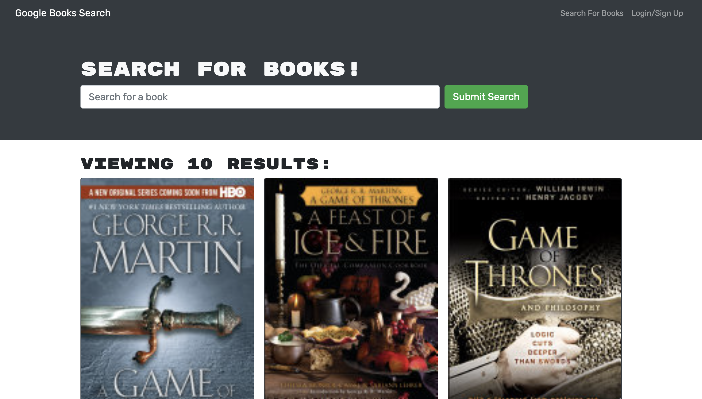

# Book Search Engine

## Description

My application allows users to search for their favorite books from the Google Book API. They are able to login, save and remove books from their library.

## Technologies Used

- Express JS
- MongoDB
- React JS
- Node JS
- Apollo Server
- GraphQL API

## Installation

To install this project:
-npm install

## Usage

